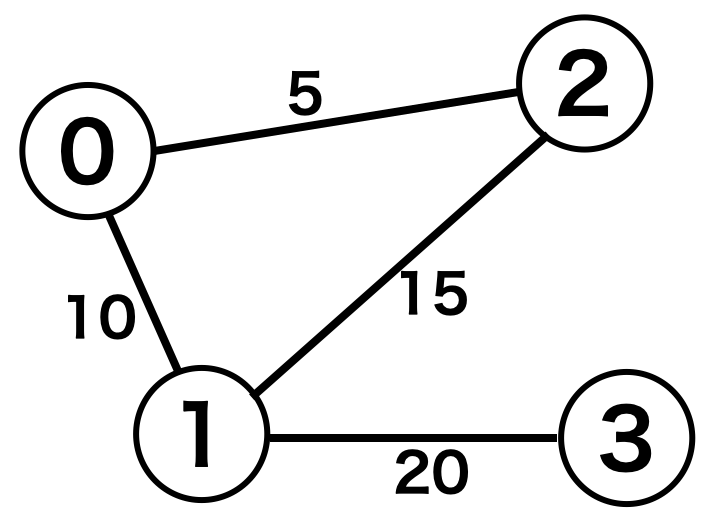
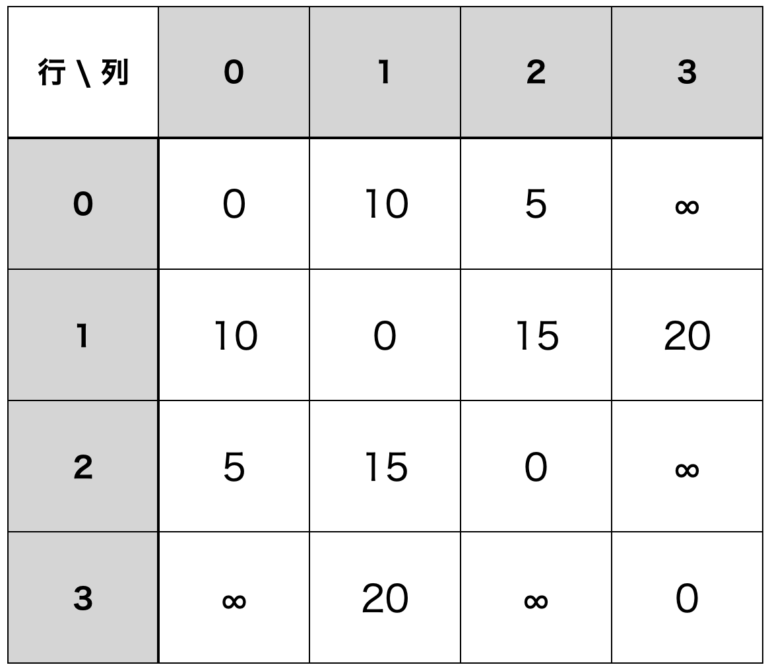

# 基本的なデータ構造とアルゴリズム

## ADT（抽象データ型）

ADT（Abstract Data Type）とは、具体的な実装は定義されておらず、単にどのような操作を持つかということのみが定義された抽象的なデータ型である。例えば、スタックというADTはpush、popという操作を持つデータ型であるが、具体的な実装は規定されていない。他に、リスト、セット、辞書、キュー、ツリー、グラフなどもADTである。

例えばマップは、キーとそれに対応する値のペアを持ち、挿入（insert）、削除（delete）、検索（find）などの操作を持つADTだが、具体的な実装方法は規定されておらず、GoやPythonでは内部的にはハッシュテーブルを用いて実装されているのに対し、C++では平衡二分探索木（赤黒木）を用いて実装されている。

対してデータ型は、データの内部表現や操作方法がプログラミング言語やユーザーによって明確に定義されたデータ型である。例えば、int、float、charなどの基本データ（primitive）型や、配列、構造体、クラスなどの複合データ型、列挙型（Enum）などがデータ型であると言える。

## 配列

### 数値配列と非数値配列、文字列

C++やRustでは、行列（matrix）との対比で、（１次元）配列のことをベクトル（vector）とも呼ぶ。データの追加や削除などの操作を持ち、特に末尾にデータを追加する操作をpush-back、末尾からデータを取り出す操作をpop-backと呼ぶ。

基本データ型としての配列型とクラスとしての配列型の２種類がある。基本データ型としての配列型はCの配列のように単なるアドレスでしかなく、対してクラスとしての配列型にはさまざまなメソッドが定義されており、基本データ型としての配列型をより便利に操作できるようにしたラッパーとなっている。

クラスとしての配列型には容量（capacity）というパラメータを指定でき、例えば要素は３つしか入っていないが、容量は８になっている場合などある。容量を超える要素を格納する必要がある場合は、新しくより大きい領域を用意して、すでにある要素をそこにコピーする必要がある。

新しい領域を用意する際に容量を１つしか増やさないとすると、要素の数が$$n$$個の場合、$$n-1$$回のコピーが必要になる。つまり$$n-1$$個の要素を追加する場合は合計で$$0 + 1 + 2 + ... + n-1 = \frac{(n-1) \times n}{2}$$回のコピーが必要になるため、$$O(n^2)$$の計算量がかかってしまう。

容量を倍ずつ増やすとすると、例えば$$n = 5$$のとき、2個目の要素を追加する際にダブリングが生じてすでに存在する1個の要素をコピーする必要があり、次は3個目の要素を追加する際にすでに存在する2個の要素をコピーする必要があり、その次は5個目の要素を追加する際にすでに存在する4個の要素をコピーする必要があるので、合計で$$1 + 2 + 4 = 7$$回のコピーが必要になる。つまり、合計で$$n \text{以上の最小の2の累乗数} - 1$$回のコピーが発生する。そのため１回あたりのコピーにかかる平均時間は$$O(1)$$であり、償却定数時間になる。このように、配列の容量を倍ずつ増やすことをダブリング（doubling）と呼ぶ。

オブジェクトの参照のみをコピーする（参照先オブジェクトは同じものを指す）ことをshallow copyと呼び、オブジェクトの実体もコピーすることをdeep copyと呼ぶ。配列をコピーする際に、配列の要素がポインタやオブジェクトの参照である場合は、その参照先のオブジェクトはコピーされないため、配列のコピーはどちらかというとshallow copyであると言える。

### １次元配列（ベクトル）と多次元配列（行列）

多次元配列を表現する方法としては、単純に連続したメモリ領域に全ての要素を並べる方法（`data[2][2]`なら`0-0`, `0-1`, `1-0`, `1-1`が連続したメモリ領域に並ぶという感じ）と、配列の中に配列のポインタを並べる方法がある。

プリミティブなやり方は、連続したメモリ領域に全ての要素を並べる方法であり、C/C++でも使われている。この方法のメリットとしては、領域を割り当てるときに一気に領域を確保できることや、ある範囲のデータを一気にコピーするという方法を取りやすいことが挙げられる。一方で、全ての配列を同じ長さにする必要があるというデメリットがあり、一方でポインタを使う方法は各配列の長さを自由に設定できるというメリットがある。

連続したメモリ領域に全ての要素を並べる方法には、行優先（row-major order）と列優先（column-major order）の２種類がある。行優先の場合は行ごとに順にアクセスするとメモリ上ではシーケンシャルなアクセスになる。一方で列優先の場合は列ごとに順にアクセスするとメモリ上ではシーケンシャルなアクセスになる。C/C++、Go、Numpyなどは行優先であり、Fortran、Matlab、Rなどは列優先である。ポインタを使用する方法では、iliffe vectorと呼ばれるデータ構造が用いられており、Java、C#、Scala、Swiftなどがこれを採用している。

行優先やiliffe vectorは、行列の要素を連続したメモリ領域に並べるため、行ごとにアクセスするとキャッシュヒット率が高くなる。列優先は列ごとにアクセスするとキャッシュヒット率が高くなる。

[多次元配列のメモリレイアウト方式について](https://qiita.com/tyoshitake/items/83ce47f169c5b037f06c)

具体的には、例えばCで下記のような２次元配列を宣言した場合、メモリ上では`1, 2, 3, 4, 5, 6, 7, 8, 9`の順に並ぶ。要素へアクセスする際は行と列のインデックスを指定するが、内部的には１次元配列として扱われているため、$$\text{行列のベースアドレス} + \text{行インデックス} \times \text{列数} + \text{列インデックス}$$のようにしてアドレスが計算される。

```c
int matrix[3][3] = {
  {1, 2, 3},
  {4, 5, 6},
  {7, 8, 9}
};
```

## レコード、構造体、タプル、オブジェクト

レコードは、構造体や複合データとも呼ばれ、データベースでは行と呼ばれる。フィールドの集まりであり、通常は固定の数と並びのフィールドから成り、配列と違って各フィールドのデータ型は異なってよい。各フィールドには名前が付いており、それによってデータにアクセスする。

レコードのフィールドは、言語によってはメンバーあるいはメンバー変数と呼ばれることもある。レコードの専用構文がない言語であっても、クラス構文をサポートする場合は、ほとんどの場面においてクラスで代用可能である。例えばJavaにはレコード型があるが、内部的にはクラスで実現される糖衣構文（syntax sugar、読み書きのしやすさのために導入される書き方）である。

タプルでは、含まれる要素が同じでも要素の順番が異なる場合は別の値として扱われる（`(1, 2)`と`(2, 1)`など）。構造体はより意味のある形の要素の集合というニュアンスを持つが、タプルは単なる要素の寄せ集めというニュアンスを持つ。タプルは配列とは違って[順序対](https://ja.wikipedia.org/wiki/順序対)で、含まれる要素が変化しないというニュアンスを持たせたいときに使う。ただその場合にも配列を使う人もいるので、そこまで厳密に使い分けられているわけではない。２要素の時は2-tuple、３要素の時は3-tuple、n要素の時はn-tapleと呼ばれる。

オブジェクトはメソッドを持つことができる。言語によってはクラスと呼ばれることもある。また文脈によってはインスタンスやクラスなどをまとめてオブジェクトと呼ぶこともある。

## 連結リスト

何個データが来るかわからなくて、どこにデータを挿入するかわからないという場面で使われる。今でもよく使われているデータ構造で、他のデータ構造の内部構造として連結リストが使われていたり、Linuxカーネルの中の構造体でよく連結リストが使われていたりする（ユーザーが何個プロセスを立ち上げるかはわからないし、ページアロケーションなどや、ハッシュテーブルなどでも使われる）。

各操作の時間計算量は探索が$$O(n)$$、挿入/削除が$$O(1)$$だが、削除の場合はその前に探索が必要であり、挿入の場合も重複を避けるために探索が必要になることが多い。先頭に要素を追加する操作については$$O(1)$$でできる。前のオブジェクトにアクセスすることは絶対ないとかでなければ、末尾の要素にすぐにアクセスしたい場合も多いので、普通は双方向連結リストを使う。

リストを使う場合、データの移動はポインタの付け替えだけで済むため、配列に比べて容易である。このことを利用して探索を高速化する方法をとるリストのことを自己再構成リスト（self re-organizing list）と呼ぶ。例えば実際の状況では、短い時間に繰り返し同じノードにアクセスが行われるこ場合が多いため、探索によってノードを見つけてくるたびにそのノードをリストの先頭に移すという方法が取られることがある。これにより通常は平均的に$$\frac{n}{2}$$回の探索が必要なところをより少ない回数で済むことが期待できる。

関数型言語では連結リストの実装時にCARやCDRなどが使われる。連結リストのノードをコンスセルと呼び、コンスセルにはCARとCDRという２つのフィールドがある。CARに要素が格納され、CDRに次のコンスセルへのポインタが格納される。最後のCDRにはポインタではなくnilが格納されることでリストの終端を表す。

[CARとCDR](https://ja.wikipedia.org/wiki/CARとCDR)

[【AutoLISP】car部とcdr部を取得する関数「car」「cdr」](https://alraku.com/car-cdr/2324/)

## スタック

典型的には配列を使って実装される。ただし、連結リストを使う場合もあり、例えばリアルタイムシステムではある一定の時間内に処理を終わらせる必要があるので、その場合はダブリングが起こってしまう配列よりも、連結リストが使われる。

## キュー、デック

キューを配列を用いて実装する場合、先頭からpopするたびに残りの要素を前に移していくようにしてしまうと$$O(n)$$の時間計算量になってしまうため、先頭と末尾が論理的に繋がっているデータ構造であるリングバッファを用いることが多い。例えば`[a, b, c, d]`とあるとき、popしたら`[nil, b, c, d]`となり、先頭を指すポインタを`b`を指すように変更し、次に`e`がpushされたら先頭を指すポインタが`b`を指したまま`[e, b, c, d]`となる。次に`f`がpushされたらダブリングされて`[b, c, d, e, f]`となる。このようにすることでpopの時間計算量は$$O(1)$$を保つことができる。

デック（deque）は両端キューとも呼ばれ、両端から要素の追加および削除ができるデータ構造である。双方向連結リストか、両方向に成長できる動的配列を使って実装されることが多い。どちらも先頭と末尾に対する挿入/削除は$$O(1)$$の時間計算量になる。両方向に成長できる動的配列は、リングバッファを使うか、配列の真ん中から要素を配置する方法で実装されることが多い。

## ハッシュテーブル、マップ

いくつかのハッシュ関数は暗号理論的には[一方向性関数](https://ja.wikipedia.org/wiki/一方向性関数)として扱われており、関数値は容易に計算できるが逆関数を求めることは困難である。例えばフォワーディングテーブル（MACアドレステーブル）の実装でハッシュテーブルが使われており、48ビット長のMACアドレスを14ビット長程度のハッシュ値に変換して使用している。14ビット長にすると16K個のMACアドレスしか格納できないが、一般的にはMACアドレステーブルは疎になるので十分である。

ハッシュテーブルの衝突解決や計算量（探索、チェイン、リハッシュ）については[ハッシュテーブルのパフォーマンスと衝突解決](https://qiita.com/rihib/items/47f9d81b28fe71b0d8e5)を参照。

## グラフ

### グラフの種類

有向（directed）グラフとは、エッジ（辺）に方向があるグラフで、エッジは一方向にのみ進むことができる。対して、無向（undirected）グラフとはエッジに方向がないグラフであり、エッジは両方向に進むことができる。

巡回（cyclic）グラフとは、少なくとも１つの閉路（サイクル）が存在するグラフであり、非巡回（acyclic）グラフとは、閉路が１つも存在しないグラフである。

連結（connected）グラフとは、任意の２つの頂点間に経路が存在するグラフであり、非連結（disconnected）グラフとは、少なくとも１組の頂点間に経路が存在しないグラフである。

重み付き（weighted）グラフとは、エッジに重み（コスト）が割り当てられているグラフであり、非重み付き（unweighted）グラフとは、エッジに重みが割り当てられていないグラフである。

ノード数に比べてエッジ数が比較的少ないグラフを疎グラフ（sparse graph）、対してエッジ数が比較的多いグラフを密グラフ（dense graph）と呼ぶ。

### グラフの表現方法

グラフを表現する方法として、隣接リストと隣接行列の２つがよく使われる。隣接リストとは、それぞれの頂点が隣接する頂点のリストを保持するデータ構造である。対して隣接行列とは、頂点間の接続を２次元配列（行列）で保持するデータ構造である。行と列が頂点を表し、セルの値がエッジの存在や重みを表す。

例えば、下記のようなグラフがあるとき、隣接行列で表現するには、この場合は頂点０と頂点１は直接繋がっており、コストが10なので、表では`{0, 1}`と`{1, 0}`の値は10になっているのがわかる。また頂点０と頂点３のように直接繋がっていない場合は値は$$inf$$となっているがわかる。

<div style="display: flex; justify-content: center; align-items: center;">
  
  
</div>

隣接リストはメモリをあまり使わないため、特にエッジの数が少ない疎グラフ（sparse graph）に対して有効であり、隣接頂点の列挙が容易である。ただ、エッジの存在を確認するのにリストの探索が必要であり、時間がかかるという欠点がある。

隣接行列はエッジの存在を$$O(1)$$の時間計算量で確認可能であり、エッジの重みも簡単に管理できる。ただ、メモリを多く使うのと、隣接頂点を列挙するのに時間がかかるという欠点がある。

### 隣接行列の乗算

隣接行列表現の場合は行列の乗算をすることができる。一般的に、隣接行列を$$n$$乗することで、グラフ内の各頂点間の長さ$$n$$のパスの数を得ることができる。例えばある非重み付きグラフの隣接行列を２乗すると、2歩で到達できる頂点の数を表す行列が得られる（行列の乗算のやり方については[行列の積（掛け算）の求め方をわかりやすく解説します！](https://lab-brains.as-1.co.jp/enjoy-learn/2023/07/50258/)を参照）。

例えば、下記のような非重み付きグラフの隣接行列があるとする。ここで1はエッジが存在することを表し、0はエッジが存在しないことを表す。

$$A = \begin{bmatrix} 0 & 1 & 1 \\ 0 & 0 & 1 \\ 0 & 0 & 0 \end{bmatrix}$$

この隣接行列$$A$$の2乗を計算すると、行列$$A^2$$の各要素$$(i, j)$$は、頂点$$i$$から頂点$$j$$への長さ2のパスの数を表す。

例えば、下記のように実際に計算してみると、結果の行列$$A^2$$では、例えば要素$$(0, 2)= 1$$であるため、頂点0から頂点2への長さ2のパスが1本存在することが分かる。

$$
A^2 = A \times A = \begin{bmatrix} 0 & 1 & 1 \\ 0 & 0 & 1 \\ 0 & 0 & 0 \end{bmatrix} \times \begin{bmatrix} 0 & 1 & 1 \\ 0 & 0 & 1 \\ 0 & 0 & 0 \end{bmatrix} = \begin{bmatrix} 0 & 0 & 1 \\ 0 & 0 & 0 \\ 0 & 0 & 0 \end{bmatrix}
$$
