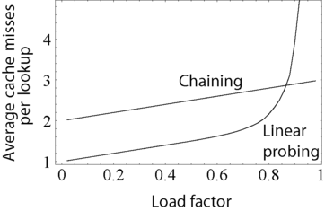

# ハッシュテーブルのパフォーマンスと衝突解決

## ハッシュテーブルとは

ハッシュテーブル（ハッシュマップ）は、連想配列（associative array。辞書、マップとも呼ばれる）を実装するデータ構造であり、キーを値にマップする抽象データ型である。キーをハッシュ関数によってハッシュ値に変換し、そのハッシュ値を使って値を格納する位置を決定する。つまり値$$x$$は$$A[h(x)]$$（$$A$$は配列、$$h$$はハッシュ関数）に格納される。

多くの場合、ハッシュテーブルは探索木（search tree）や他のテーブル検索構造よりも平均的には効率的である。例えば、検索、挿入、削除操作において、合理的な仮定のもとでは、平衡二分探索木（self-balancing binary search tree）よりも優れた時間計算量で実行できる。

合理的な仮定とは、ハッシュ関数の作り方が悪くなければ、ハッシュ関数の値がすべて同じになるような最悪のケースが実際に起こる確率は低いため、無視できるというものである。例えば衝突解決にチェイン法を用いる場合、ハッシュ関数の値がすべて同じになると、探索の時間計算量は$$O(n)$$になる。
（しかし、そのような最悪の事態が絶対に起こらないとは言い切れない。万が一にもそのようなことがあってはいけないという場合にはそもそもハッシュを使うべきではなく、最悪の場合の性能が保証される平衡木を採用すべきである。）

そのため、ハッシュテーブルは、特に連想配列を実装するのによく使われている。他にもデータベースインデックスとして使用されることもあるが、一般的にはBツリーが使われることが多い。またキャッシュを実装するのにも使用でき、衝突した場合は衝突した２つのエントリのうちの１つを破棄することで衝突解決する。他にもセット（set）を実装する際に、単にそのキーがすでに存在するかをチェックするためによく使われる。

適切に次元化されたハッシュテーブルでは、検索、挿入、削除の最悪時間計算量は$$O(n)$$だが、平均時間計算量は$$O(1)$$で、空間時間計算量は$$O(n)$$である。ハッシュテーブルの時間計算量は空間計算量とのトレードオフであり、メモリが無限であればキー全体をインデックスとして直接使用して、常に$$O(1)$$の時間計算量を実現できる。

## ハッシュ関数

いくつかのハッシュ関数は暗号理論的には[一方向性関数](https://ja.wikipedia.org/wiki/一方向性関数)として扱われており、関数値は容易に計算できるが逆関数を求めることは困難である。例えばフォワーディングテーブル（MACアドレステーブル）の実装でハッシュテーブルが使われており、48ビット長のMACアドレスを14ビット長程度のハッシュ値に変換して使用している。14ビット長にすると16K個のMACアドレスしか格納できないが、一般的にはMACアドレステーブルは疎になるので十分である。

ハッシュ関数は、キーの値を0から$$m$$-1までの範囲にできるだけ一様に散らばせられるものが良い。キーが正の整数である場合は、それを$$m$$で割った余りをハッシュ値とするのが大抵の場合、安全な方法である。この場合、同じハッシュ値となるのは$$m$$の倍数だけ離れた値を持つキーであり、そのようなキーが数多く現れる例は少ないと言えるだろう。

ハッシュ関数をできるだけランダムなものにするためにはキーのすべてのビットの値が結果に影響することが望ましい。例えば$$m = 2^k$$とすると、下位の$$k$$ビットだけでハッシュ値が決まることになってしまうため、良くない。そのため、$$m$$には素数が適しているとされる。

キーが文字列の場合は、まず何らかの方法で文字列から整数値を得て、それを$$m$$で割った余りを取れば良い。整数値を得る手段としては、文字列を構成する文字の順序数を利用する方法が一般的である。

例えば、`abc`という文字列があるとき、ASCIIコードではそれぞれ、97, 98, 99という順序数を持つので、定数$$c$$を用いて、$$97 \times c^2 + 98 \times c^1 + 99 \times c^0$$のようにして整数値を取得する。

$$c = 1$$とすると各文字に同じ値（この場合は1）をかけることになるので、例えば`ab`, `bc`, `cb`, `da`から得られる整数値が同じ197になってしまう。そのため各文字を平等に扱うのは避けた方が良い。

１文字を8ビットで表現しているのであれば、$$c = 256$$とすることで単にメモリ上に置かれている文字列を整数値として解釈するだけで済む（乗算を一切しなくて良くなる）ので、文字列から整数を得る計算を高速化できる（値を256倍するのと、8ビット左シフトするのは同等の処理なため）。整数値として解釈するには、整数を32ビットで表現しているのであれば、単に４バイト（４文字）を１つの整数としてみなして扱えば良い。

## 衝突解決

ハッシュテーブルの挿入操作には大きく２つのフェーズがあり、最初にハッシュ関数を使って値からインデックスを計算した後、次に衝突解決（collision resolution）をする必要がある。衝突解決方法には、大きくチェイン法とオープンアドレス法の２つがある。

チェイン法（separate chaining、分離連鎖法）は衝突したら連結リストやツリーなどで同じ位置に連ねて格納する。オープンアドレス法は言葉の通り衝突した場合は空きスロットを探してデータを格納する。

衝突回避（collision avoidance）という言葉も使われるが、これはハッシュ関数の設計やハッシュテーブルのサイズを適切に選ぶことで、そもそも衝突が発生する確率を減らす手法である。対して衝突解決（collision resolution）は、衝突が発生した場合に、どのようにしてデータを正しく格納するかを扱う手法である。

### チェイン法

#### 衝突解決に用いるデータ構造

チェイン法では連結リストを使って衝突解決するのが一般的だが、キーが順序立てられている場合は平衡二分探索木などを使うのが効率的であり、その場合は最悪時間計算量であっても$$O(log N)$$である。

他には大量のメモリを使う代わりに$$O(1)$$の最悪時間計算量を実現できるdynamic perfect hashingや、高い確率ですべての操作において$$O(1)$$の時間計算量を実現するFusion Treeなどがある。

チェイン法において連結リストを使う場合、ノードがメモリ上に分散して存在することが多く、キャッシュのヒット率が低下するという問題がある。このキャッシュ効率を考慮したチェイン法の変種として、連結リストや平衡二分探索木の代わりに、よりキャッシュフレンドリーな動的配列を使用する方法がある。動的配列では要素が連続したメモリに配置されるため、参照局所性によってCPUキャッシュを有効に活用でき、またTLBヒットしやすくなることからアクセス時間が短縮され、同じページテーブルエントリが使用されることからメモリ消費も削減できる。

### オープンアドレス法

#### 探索

オープンアドレス法で衝突が発生した際に別の空きスロットを探すことを探索（probing）と呼ぶ。探索には、線形探索（linear probing）、二次探索（quadratic probing）、二重ハッシュ（double hashing）などがある。線形探索は次の位置を順次調べていく方法で、二次探索は衝突が発生した場合に二次関数を使用して次のスロットを計算してそこが空いていれば要素を挿入する方法で、二重ハッシュは異なるハッシュ関数を用いて新しい位置を決定する方法である。

線形探索をする場合は後述するようにクラスタができてしまうことが問題となる。クラスタを防ぐための手法として均一ハッシュ法がある。均一ハッシュ法は、それぞれ同じ値を入れても異なるハッシュ値を返すハッシュ関数を$$m$$個用意し、１番目のハッシュ関数によってハッシュ値を求め、衝突した場合は２番目のハッシュ関数によってハッシュ値を求める、という手法である。しかし、この方法はハッシュ関数の計算の手間が増えて効率が悪い。

そこで比較的簡単で性能が良いのは、２つのハッシュ関数$$h(x)$$と$$g(x)$$を用意して、下記のようにそれぞれのハッシュ値を計算する方法である。この方法を二重ハッシュと呼ぶ。ハッシュ関数の計算の手間が倍になるが、この程度なら問題ない。$$0$$から$$m-1$$の範囲に満遍なく分散するには$$g(x)$$の値が$$m$$と互いに素であることが必要である。そのため前述したように$$m$$として素数をとると、この点においても好都合である。

$$
h_0(x) = h(x) \\
h_1(x) = h(x) + 1 \times g(x) \\
h_2(x) = h(x) + 2 \times g(x) \\
h_3(x) = h(x) + 3 \times g(x) \\
$$

#### 削除

オープンアドレス法ではデータの削除が難しい。削除した場所を単純に空にすると、探索の途中で空のスロットに出会った場合、それが本来のデータが入っていたスロットであるか、削除されたスロットであるかを判別することができない。通常は空であると未使用のスロットとして扱われるため、そこで探索が終了してしまい、それ以上先に本来のデータがあったとしてもそれを見つけることができなくなる。

例えば線形探索を用いている場合、キーaとbのハッシュ値が同じ場合、両方を挿入する際に衝突が起こるため、aの隣にbが挿入される。このときbを探索したい場合は、まずハッシュ値からaのスロットに行き、キーbではなくaが入っているため、次のスロットを確認し、bのスロットを発見するということを行う。しかし、もしaを削除するためにaのスロットを単に空にしてしまうと、bを探索する際にまずaが入っていたスロットに行くと空になっているため、そこでbは存在しないと判断され、探索が終了してしまう。

そのため、正しく削除するには、ハッシュテーブルの要素の状態を、未使用、使用中、削除ずみの３種類用意する必要がある。そうすることで探索の際に削除ずみの場所があっても探索を終了せずに次のスロットの探索を続けるようにできる。新たに要素を挿入する際には、未使用の場所か削除ずみの場所を再利用して新しいデータを入れれば良い。

しかしこの方法は挿入と削除が頻繁に繰り返されるような場合には使えない。削除ずみの場所はある程度は再利用されるかもしれないが、長期的には未使用の場所が減って削除ずみの場所が増え、探索においてはほとんどの場所が使用中であるのと同じ状態になるので、探索性能が大きく低下してしまうことになる。

線形探索であれば、削除の際に、同時に次の要素を調べて存在していればそれを削除ずみの場所に移動させて詰めるということをすればこの問題を避けられるが、これはあまり速い操作ではない。また二重ハッシュ法の場合、この性能問題を避けられる削除の方法は知られていない。

## クラスタ

ハッシュ関数において、ハッシュ値がどれだけ均一に分散するかは重要な要素である。ハッシュ値が特定の箇所のみに偏在すると衝突解決コストが増加してしまう。オープンアドレス法では、クラスタリング（２つ以上の連続するスロットに要素が存在すること）を避けるべきであり、たとえ占有率が低くても、クラスタの形成は検索コストの増加につながる。そのため、ハッシュテーブルのパフォーマンスは、ハッシュ関数の準乱数（quasi-random numbers）生成能力に依存する。

衝突解決にオープンアドレス法の線形探索を用いている場合、例えばハッシュ値が$$h$$のデータと$$h+1$$のデータがすでにハッシュテーブルに存在しているとき、ハッシュ値$$h$$のデータを追加で挿入しようとすると、$$h$$も$$h+1$$も塞がっているので$$h+2$$の場所に入れる必要が生じる。つまり違うハッシュ値（$$h+1$$）のデータの存在によっても、クラスタリングが生じ、調べるデータの数が増えることがある。チェイン法ではハッシュ値が異なれば、両者のデータの探索経路は完全に独立であるが、線形探索の場合はハッシュ値の違うデータ同士が互いに影響し合って性能が低下する可能性があるのである。実際にハッシュ関数の作り方によっては、１だけ違うハッシュ値がしばしば現れることがある。コンパイラの例では、$$x1$$, $$x2$$, ...のような識別子が現れてそれらのハッシュ値が１ずつ異なるというのは十分考えられることである。

## 占有率とリハッシュ

占有率（load factor）というハッシュテーブルの重要な統計値があり、$$\frac{n}{m}$$（$$m$$はハッシュテーブルのスロット数、$$n$$は実際に存在する要素数）で求められる。
ハッシュテーブルのパフォーマンスは占有率の増加に伴って低下するため、一般的には占有率がある閾値以上になると（または占有率が低くなりすぎると）ハッシュテーブルのサイズを変更する。このことをリハッシュ（rehash）と呼ぶ。

リハッシュする際は、同じハッシュ値を使って単純にアイテムを新しいハッシュテーブルにコピーすることはできないので、一般的にはもとのハッシュテーブルの倍のサイズを持つ新たなハッシュテーブルが割り当てられると、もとのハッシュテーブルのすべてのアイテムは、ハッシュ値を計算し直して新しいテーブルに挿入される。これは単純だが計算コストがかかるため、特にリアルタイムシステムなどで、このコストが無視できない場合に別の方法が取られることがある。

チェイン法では、占有率が増加するにつれて徐々にパフォーマンスが低下するが、リハッシュが絶対に必要となる固定の閾値は存在しない。通常、最高のパフォーマンスを発揮するのは占有率が１〜３の間である。

対してオープンアドレス法では、すべての空き領域がなくなればそれ以上要素を挿入できなくなるため、占有率１を超えることはできず、占有率１に近づくとパフォーマンスは非常に悪くなるため、その際は必ずリハッシュする必要がある。また、当然だが占有率が１になると無限ループに陥る。通常、占有率の許容限界範囲は0.6〜0.75の間になる。

## パフォーマンス

下記は縦軸がキャッシュミスの平均数、横軸が占有率であり、チェイン法と線形探索で比較したものである。線形探索は参照局所性が優れているために性能は高くなるが、占有率が１に近づくと急激に性能が低下する。

  

## 参考

[Hash table - Wikipedia](https://en.wikipedia.org/wiki/Hash_table)
